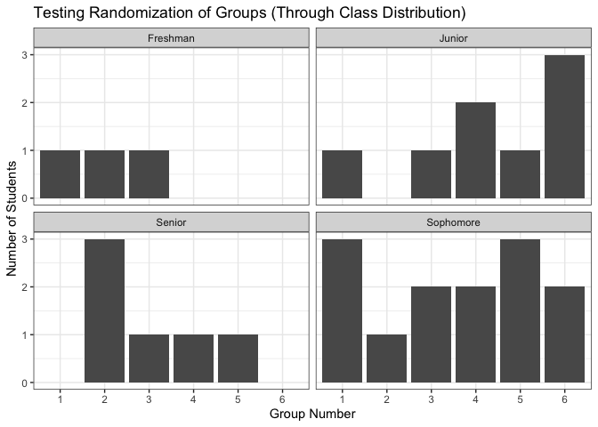
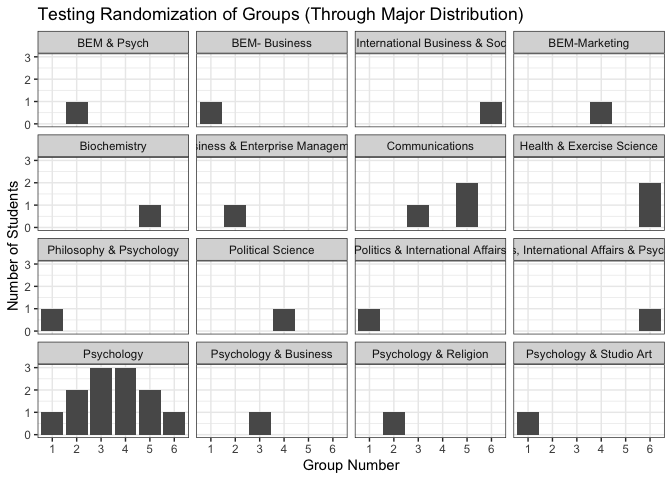

Randomizing Student Groups
================
Heather Hawkins
2023-02-07

------------------------------------------------------------------------

Loading Students’ names and info into R.

``` r
library(readxl)
Cross_Cult_Groups <- read_excel("~/Documents/GitHub/Project-1/Cross-Cult Groups.xls")
View(Cross_Cult_Groups)
```

## Randomizing Part 1

Seeing if the data works and if everything is there.

``` r
head(Cross_Cult_Groups, n=30)
```

    ## # A tibble: 30 × 5
    ##    Name               Hometown                    Class     Major          Minor
    ##    <chr>              <chr>                       <chr>     <chr>          <chr>
    ##  1 Jazmin Aguilar     Winston-Salem, NC           Senior    BEM-Marketing  Engl…
    ##  2 Sarah Binkley      Mooresville, NC             Junior    Psychology     Heal…
    ##  3 Sara Braunshweiger Port Washington, NY         Junior    Biochemistry   Psyc…
    ##  4 Taylor Colony      Lexington, KY               Senior    Psychology     Chem…
    ##  5 Deneaka Duncanson  The Bronx, NY               Junior    Politics & In… Glob…
    ##  6 Keith Elam         Henderson, NC               Junior    Political Sci… <NA> 
    ##  7 Monse Estrada      Chicago, IL                 Sophomore Psychology     Reli…
    ##  8 Stephanie Evanson  Los Altos, CA               Junior    Psychology     Neur…
    ##  9 Abbi Fister        Lexington, KY               Junior    Health & Exer… Neur…
    ## 10 Jacqueline Gillen  Glen Cove, NY (Long Island) Sophomore Psychology     Soci…
    ## # … with 20 more rows

## Randomizing Part 2

Randomizing students by name, setting a seed to keep the randomization
that was given.

``` r
set.seed(32)
random_G<- Cross_Cult_Groups %>% 
  group_by(Name) %>% 
  summarise(Name, Class, Hometown, Major, Minor) %>% 
  sample_n(30) 

##Labeling into 6 groups

ID <- c("1","1","1","1","1","2","2","2","2","2","3","3","3","3","3","4","4","4","4","4","5","5","5","5","5","6","6","6","6","6")


random_G_Final <- cbind(random_G, ID)


view(random_G_Final)
```

## Analyzing Data

``` r
ggplot(data = random_G_Final, aes(x= ID)) +
  geom_bar()+
         facet_wrap(~Class)+ labs(title = "Testing Randomization of Groups (Through Class Distribution)")+
  theme_bw()+
  labs(x = "Group Number", y = "Number of Students")
```

<!-- -->

It seems as if there are 3 Freshman, 14, Sophomores, 8 Juniors, and 6
Seniors.

Group 1 consists of 1 Freshman, 3 Sophomores, 1 Junior, and 0 Seniors.

Group 2 consists of 1 Freshman, 1 Sophomore, 0 Juniors, and 3 Seniors.

Group 3 consists of 1 Freshman, 2 Sophomores, 1 Junior, and 1 Senior.

Group 4 consists of 0 Freshman, 2 Sophomores, 2 Juniors, and 1 Senior.

Group 5 consists of 0 Freshman, 3 Sophomores, 1 Junior, and 1 Senior.

Group 6 consists of 0 Freshman, 2 Sophomores, 3 Junior, and 0 Seniors.

Overall, it seems as if only the Sophomores were evenly distributed. The
Juniors and Seniors had enough students for at least one of them to be
in each group, but this was not so. Additionally, the 3 Freshman were
distributed among the first 3 groups, and not too randomly among all 6.

In all, the groups did not seem to be evenly distributed by class.

``` r
ggplot(data = random_G_Final, aes(x= ID)) +
  geom_bar()+
         facet_wrap(~Major)+ labs(title = "Testing Randomization of Groups (Through Major Distribution)")+
  theme_bw()+
  labs(x = "Group Number", y = "Number of Students")
```

<!-- -->

Overall, it seems as if (soley) Psych Major students were even
distributed among groups. Additionally, the Majors with one student were
evenly distributed. On the other hand, one Major (Health & Science
Exercise) had both of its students in one group.

If the number of students were more than 30, the normal distribution
would be more even. With a random assigment of large groups, I could see
this code being used.
